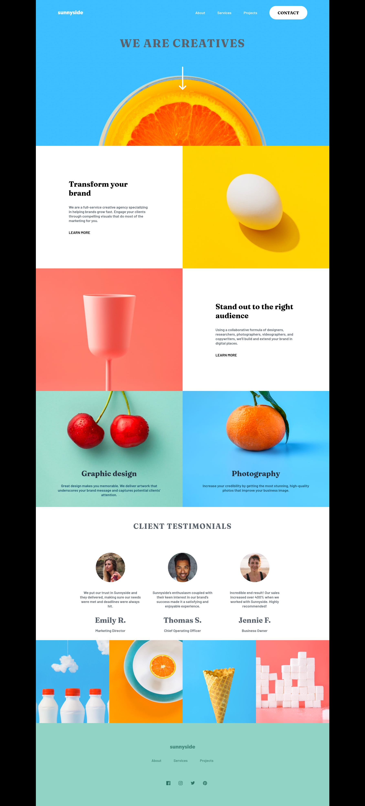

# Frontend Mentor - Sunnyside agency landing page solution

This is a solution to the [Sunnyside agency landing page challenge on Frontend Mentor](https://www.frontendmentor.io/challenges/sunnyside-agency-landing-page-7yVs3B6ef). Frontend Mentor challenges help you improve your coding skills by building realistic projects.

## Table of contents

- [Overview](#overview)
  - [The challenge](#the-challenge)
  - [Screenshot](#screenshot)
  - [Links](#links)
- [My process](#my-process)
  - [Built with](#built-with)
  - [What I learned](#what-i-learned)
  - [Continued development](#continued-development)
  - [Useful resources](#useful-resources)
- [Author](#author)

## Overview

### The challenge

Users should be able to:

- View the optimal layout for the site depending on their device's screen size
- See hover states for all interactive elements on the page

### Screenshot

### Links

- Solution URL: (https://github.com/francobwogo/sunnyside.git)
- Live Site URL: (https://francobwogo.github.io/sunnyside/)

## My process

### Built with

- Semantic HTML5 markup
- CSS custom properties
- Flexbox
- CSS Grid
- Mobile-first workflow
- JavaScript

### What I learned

- Using media queries.
- HTML
- CSS
- JavaScript

### Continued development

- I need to learn and practise more CSS and JavaScript.

### Useful resources

- CSS-Tricks (https://css-tricks.com/) - CSS
- The Odin Project (https://www.theodinproject.com/)
- codefoxx - JavaScript - How to Create a Responsive Hamburger Menu with HTML, CSS, & JavaScript (https://www.youtube.com/watch?v=flItyHiDm7E)

## Author

- Frontend Mentor - [@francobwogo](https://www.frontendmentor.io/profile/francobwogo)
